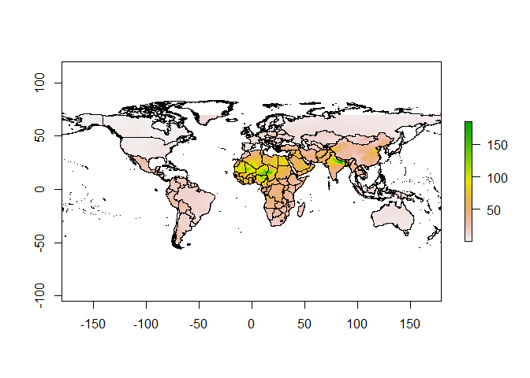

<!-- README.md is generated from README.Rmd. Please edit that file -->

# dimaqdata

<!-- badges: start -->
<!-- badges: end -->

This package contains eight datasets provided by the members of the Data
Integration Task Force, a multi-disciplinary group of experts
established as part of the recommendations from the first meeting of the
WHO Global Platform for Air Quality in Geneva, January 2014.

-   `who_world_map`: `sf` WHO world map shapefile

-   `ground_monitor`: `sf` Yearly global ground monitor station

-   `population_weighted_concentrations`: `df` Yearly population
    weighted pm2.5 concentrations by country or WHO region

-   `Exceed`: `df` Yearly exceedances by country at 10,15,20,25 spatial
    scale

-   `pred_2011`: `sf` 2011 Global Predictions spatial resolution (0.1° ×
    0.1°)

-   `pred_2012`: `sf` 2012 Global Predictions spatial resolution (0.1° ×
    0.1°)

-   `pred_2013`: `sf` 2013 Global Predictions spatial resolution (0.1° ×
    0.1°)

-   `pred_2014`: `sf` 2014 Global Predictions spatial resolution (0.1° ×
    0.1°)

-   `pred_2015`: `sf` 2015 Global Predictions spatial resolution (0.1° ×
    0.1°)

-   `pred_2016`: `sf` 2016 Global Predictions spatial resolution (0.1° ×
    0.1°)

## Installation

You can install the development version of dimaqdata from
[GitHub](https://github.com/) with:

``` r
# install.packages("devtools")
devtools::install_github("environmental-intelligence-exeter/dimaqdata")
```

## Example

Plot 2016 global predictions

``` r
library(dimaqdata)
library(raster)
library(dplyr)
# filter prediction data by value
data_new = pred_2016 %>% dplyr::select("Longitude", "Latitude",  "Mean")
# generate raster from prediction
r = raster::rasterFromXYZ(data_new)
# set crs the same as WHO world map
crs(r) = raster::crs(who_world_map)
# base plot
plot(who_world_map$geometry)
plot(r, add = T)
```


